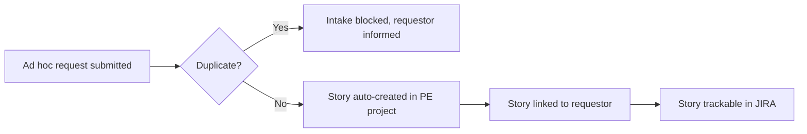

# Story 1 — Automated Intake (Director of Platform Engineering)

> **As a** Director of Platform Engineering,
> **I want** an automated way for ad hoc work requests from other teams to be added as stories in JIRA,
> **so that** incoming work is captured and tracked without manual overhead.

---

## Section 1 — Quick Acceptance Criteria (Human-Readable)

- Ad hoc requests are captured automatically as **Story** issues in the **PE** JIRA project without manual re-keying.
- Every captured request results in exactly one trackable ticket (or zero, when intake is intentionally blocked).
- Each ticket retains a link back to the original requestor.
- No Platform Engineer action is required for a request to be captured and tracked.
- The intake pipeline runs end-to-end (submit → capture → create/track) without manual steps by the Director.

---

## Section 2 — Detailed Acceptance Criteria (Gherkin)

```gherkin
Feature: Automated intake of ad hoc work requests

  Scenario: A valid request is captured automatically
    Given a requestor has submitted an ad hoc work request
    And the request is not a duplicate
    When the intake process completes
    Then a Story is created in the PE JIRA project
    And the Story is linked to the originating requestor
    And no manual data entry by the Director was required

  Scenario: Captured work is trackable
    Given a Story has been created through automated intake
    When the Director views the PE JIRA project
    Then the Story appears with all captured request details
    And the Story can be tracked through its lifecycle statuses

  Scenario: Intake requires no engineer involvement
    Given an ad hoc work request enters intake
    When the Story is created
    Then no Platform Engineer is notified or assigned as part of capture
```

**Definition of Done (this story):** 100% of requests submitted through the approved intake channel are either captured as a PE Story or intentionally blocked (duplicate), with zero manual re-keying by the Director for captured items.

---

## Section 3 — Process / Sequence Flow



---

## Section 4 — Assumptions & Dependencies

- **Assumptions:** A single approved intake channel is used; the PE JIRA project and Story issue type already exist; requestors have access to the intake channel.
- **Dependencies:** JIRA (PE project), the intake submission mechanism (see [Story 2](story2-ac.md)), duplicate detection (see [Story 8](story8-ac.md)).

---

## Section 5 — Definition of Done (Measurable)

- [ ] ≥ 95% of submitted, non-duplicate requests are auto-created as PE Stories with no manual re-keying.
- [ ] 100% of created Stories are linked to their requestor.
- [ ] 0 Platform Engineers are notified or assigned during the capture phase.
- [ ] Intake pipeline completes end-to-end for a submitted request in a single automated flow.
- [ ] Acceptance criteria reviewed and approved by the Director of Platform Engineering.
