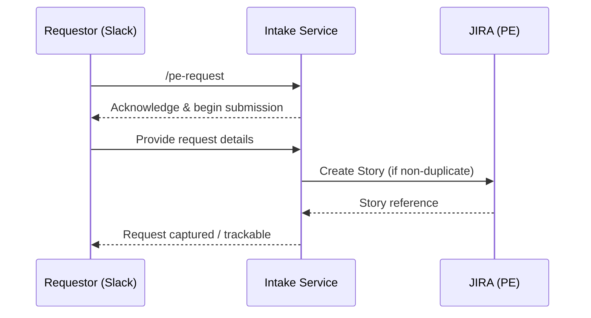

# Story 2 — Slack-Based Request Submission (Requestor)

> **As a** requestor,
> **I want** to send the `/pe-request` command in Slack with my request,
> **so that** I know it creates a trackable Story in the Platform Engineering (PE) JIRA project.

---

## Section 1 — Quick Acceptance Criteria (Human-Readable)

- The `/pe-request` command is available to anyone in the Slack workspace.
- Running the command begins the request submission flow directly from Slack.
- A completed submission results in a trackable **Story** in the **PE** JIRA project.
- The requestor stays within Slack for the entire submission.
- The requestor receives an in-Slack acknowledgement that submission has started.

---

## Section 2 — Detailed Acceptance Criteria (Gherkin)

```gherkin
Feature: Submit a Platform Engineering request from Slack

  Scenario: Command is available to any workspace member
    Given a user is a member of the Slack workspace
    When they type /pe-request
    Then the request submission flow begins

  Scenario: Submission creates a trackable Story
    Given a requestor has completed the request submission flow
    And the request is not a duplicate
    When the submission is finalized
    Then a Story is created in the PE JIRA project
    And the requestor can track the request from the created Story

  Scenario: Requestor is acknowledged in Slack
    Given a requestor runs /pe-request
    When the flow starts
    Then the requestor receives an acknowledgement in Slack
```

**Definition of Done (this story):** Any workspace member can start `/pe-request` and, on completion of a non-duplicate request, obtain one trackable PE Story without leaving Slack.

---

## Section 3 — Process / Sequence Flow



---

## Section 4 — Assumptions & Dependencies

- **Assumptions:** Slack workspace membership is the access boundary; the PE project and Story issue type exist.
- **Dependencies:** Slack app/command registration, the AI interview flow (see [Story 3](story3-ac.md)), duplicate check (see [Story 8](story8-ac.md)), confirmation (see [Story 5](story5-ac.md)).

---

## Section 5 — Definition of Done (Measurable)

- [ ] `/pe-request` is invokable by 100% of Slack workspace members.
- [ ] ≥ 95% of completed, non-duplicate submissions produce exactly one PE Story.
- [ ] 100% of invocations return an in-Slack acknowledgement.
- [ ] Requestor completes submission without leaving Slack in 100% of flows.
- [ ] Acceptance criteria reviewed and approved by the Director of Platform Engineering.
