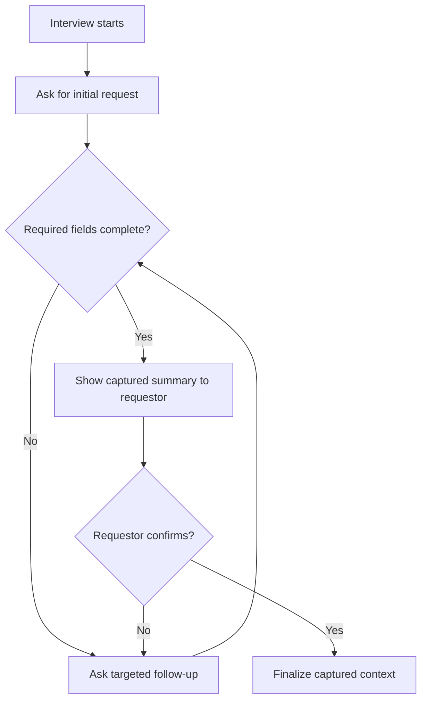

# Story 3 — Guided Context Gathering (Requestor)

> **As a** requestor,
> **I want** an AI-driven interview to gather context, deadlines, and specific information about my ask,
> **so that** the resulting ticket contains everything an engineer needs to act on it.

---

## Section 1 — Quick Acceptance Criteria (Human-Readable)

- The interview collects all required fields: summary, description, deadline, priority, requesting team, business impact, and links/attachments.
- Follow-up questions adapt to the request rather than following a fixed script.
- The requestor can review and correct captured answers before finalizing.
- Every required field is present on the resulting ticket.
- The interview completes without the requestor needing to know JIRA field names.

---

## Section 2 — Detailed Acceptance Criteria (Gherkin)

```gherkin
Feature: AI-driven interview for request context

  Scenario: All required information is collected
    Given a requestor has started the intake interview
    When the interview completes
    Then the summary, description, deadline, priority, requesting team,
         business impact, and links/attachments have been captured

  Scenario: Questions adapt to the request
    Given a requestor provides an initial request
    When information is missing or ambiguous
    Then the interview asks follow-up questions targeted at the gap

  Scenario: Requestor can correct answers before finalizing
    Given a requestor has answered the interview questions
    When they review the captured information
    Then they can amend any answer before the request is finalized

  Scenario: Captured context carries onto the ticket
    Given the interview has been completed
    When a Story is created
    Then all captured fields are present on the Story
```

**Definition of Done (this story):** Every finalized interview yields a request record containing all seven required fields, verified by the requestor before submission.

---

## Section 3 — Process / Sequence Flow



---

## Section 4 — Assumptions & Dependencies

- **Assumptions:** The seven required fields are the agreed minimum; requestors can answer in natural language.
- **Dependencies:** Slack submission entry point (see [Story 2](story2-ac.md)), Story creation which persists the fields (see [Story 1](story1-ac.md)).

---

## Section 5 — Definition of Done (Measurable)

- [ ] 100% of finalized interviews capture all seven required fields.
- [ ] Requestor is offered a review-and-edit step in 100% of interviews.
- [ ] Interview asks at least one adaptive follow-up when a required field is missing (0 finalized records with empty required fields).
- [ ] 100% of captured fields appear on the resulting Story.
- [ ] Acceptance criteria reviewed and approved by the Director of Platform Engineering.
