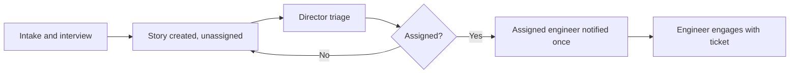

# Story 4 — Clean Hand-off (Platform Engineer)

> **As a** Platform Engineer,
> **I want** to never be involved with the ingestion of work until it is assigned to me,
> **so that** I can stay focused and only engage once work is officially routed to me.

---

## Section 1 — Quick Acceptance Criteria (Human-Readable)

- Platform Engineers receive no notifications during intake, interview, or creation.
- An engineer is engaged only after the Director assigns a Story to them.
- Unassigned Stories do not surface in an individual engineer's work queue.
- On assignment, the assigned engineer is notified once, with the ticket ready to act on.
- No engineer is required to triage or field incoming requests.

---

## Section 2 — Detailed Acceptance Criteria (Gherkin)

```gherkin
Feature: Engineers engaged only after assignment

  Scenario: No engineer involvement during intake
    Given an ad hoc request is being submitted, interviewed, or created
    When the Story is created but not yet assigned
    Then no Platform Engineer is notified about it

  Scenario: Engineer notified on assignment
    Given an unassigned Story exists in the PE project
    When the Director assigns it to a Platform Engineer
    Then that engineer is notified
    And the Story is ready for the engineer to act on

  Scenario: Unassigned work stays out of individual queues
    Given a Story has not been assigned
    When a Platform Engineer views their assigned work
    Then the unassigned Story does not appear
```

**Definition of Done (this story):** No Platform Engineer receives any signal about a request until the moment of assignment, at which point exactly the assigned engineer is notified.

---

## Section 3 — Process / Sequence Flow



---

## Section 4 — Assumptions & Dependencies

- **Assumptions:** Assignment is performed solely by the Director/team lead; "involvement" means notifications and queue visibility.
- **Dependencies:** Triage & assignment (see [Story 7](story7-ac.md)), status notifications scope (see [Story 6](story6-ac.md)).

---

## Section 5 — Definition of Done (Measurable)

- [ ] 0 notifications reach any Platform Engineer before assignment.
- [ ] 100% of assignments notify exactly the assigned engineer.
- [ ] 0 unassigned Stories appear in an individual engineer's assigned-work queue.
- [ ] Assigned Story contains all captured fields at time of assignment.
- [ ] Acceptance criteria reviewed and approved by the Director of Platform Engineering.
