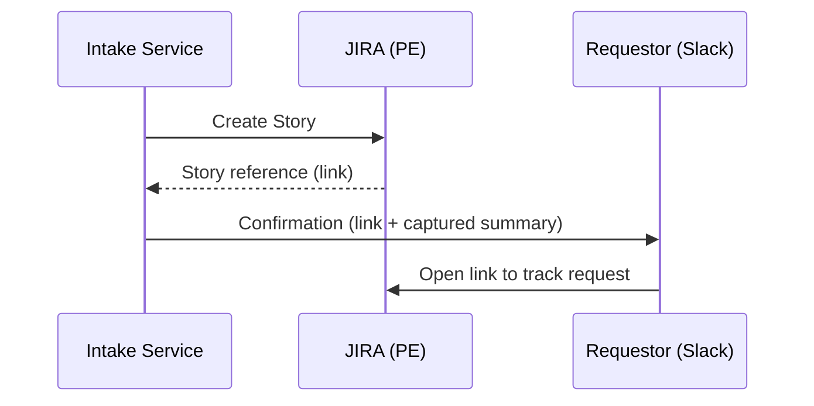

# Story 5 — Confirmation & Traceability (Requestor)

> **As a** requestor,
> **I want** to receive a Slack confirmation with the JIRA link and a summary of what was captured,
> **so that** I can verify my request was understood and follow it going forward.

---

## Section 1 — Quick Acceptance Criteria (Human-Readable)

- On successful creation, the requestor receives a Slack confirmation.
- The confirmation includes a direct link to the created JIRA Story.
- The confirmation includes a summary of the captured details.
- The confirmation is delivered to the requestor who submitted the request.
- The requestor can open the linked Story to track it going forward.

---

## Section 2 — Detailed Acceptance Criteria (Gherkin)

```gherkin
Feature: Slack confirmation with link and summary

  Scenario: Confirmation sent after Story creation
    Given a requestor's request has been created as a PE Story
    When creation succeeds
    Then the requestor receives a Slack confirmation

  Scenario: Confirmation contains link and summary
    Given a confirmation is sent to the requestor
    When the requestor reads it
    Then it contains a working link to the created Story
    And it contains a summary of the captured details

  Scenario: Requestor can follow the request
    Given the requestor has received the confirmation
    When they open the linked Story
    Then they can view and track their request
```

**Definition of Done (this story):** Every successfully created Story produces a Slack confirmation to the requestor containing a working JIRA link and a summary of captured details.

---

## Section 3 — Process / Sequence Flow



---

## Section 4 — Assumptions & Dependencies

- **Assumptions:** The requestor's Slack identity is known from submission; a confirmation is sent only on successful creation.
- **Dependencies:** Story creation (see [Story 1](story1-ac.md)), captured interview data (see [Story 3](story3-ac.md)); blocked/duplicate cases handled separately (see [Story 8](story8-ac.md)).

---

## Section 5 — Definition of Done (Measurable)

- [ ] 100% of successfully created Stories generate a Slack confirmation to the requestor.
- [ ] 100% of confirmations contain a resolvable JIRA link to the correct Story.
- [ ] 100% of confirmations contain a summary of captured details.
- [ ] Confirmation is delivered to the originating requestor in 100% of cases.
- [ ] Acceptance criteria reviewed and approved by the Director of Platform Engineering.
