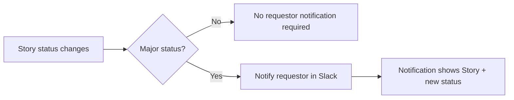

# Story 6 — Status Visibility (Requestor)

> **As a** requestor,
> **I want** to be notified in Slack on all major status changes (Created, Assigned, In Progress, Blocked, Done, Closed/Won't Do),
> **so that** I stay informed without having to check JIRA manually.

---

## Section 1 — Quick Acceptance Criteria (Human-Readable)

- The requestor is notified in Slack on each major status change.
- Covered statuses: Created, Assigned, In Progress, Blocked, Done, Closed/Won't Do.
- Each notification identifies the Story and its new status.
- Notifications go to the original requestor.
- No manual JIRA checking is required to learn a status change.

---

## Section 2 — Detailed Acceptance Criteria (Gherkin)

```gherkin
Feature: Slack notifications on major status changes

  Scenario Outline: Requestor notified on a major status change
    Given a Story linked to a requestor
    When the Story transitions to "<status>"
    Then the requestor receives a Slack notification
    And the notification identifies the Story and the new status

    Examples:
      | status          |
      | Created         |
      | Assigned        |
      | In Progress     |
      | Blocked         |
      | Done            |
      | Closed/Won't Do |

  Scenario: Non-major changes do not spam the requestor
    Given a Story linked to a requestor
    When a change occurs that is not a major status change
    Then no status-change notification is required for that change
```

**Definition of Done (this story):** Each of the six major status transitions on a linked Story sends one Slack notification to the requestor identifying the Story and its new status.

---

## Section 3 — Process / Sequence Flow



---

## Section 4 — Assumptions & Dependencies

- **Assumptions:** The six listed statuses are the complete set of "major" changes; the requestor↔Story link is preserved.
- **Dependencies:** Requestor traceability link (see [Story 5](story5-ac.md)), triage/assignment transitions (see [Story 7](story7-ac.md)).

---

## Section 5 — Definition of Done (Measurable)

- [ ] 100% of the six major status transitions trigger a Slack notification to the requestor.
- [ ] 100% of notifications identify the Story and its new status.
- [ ] Notifications are delivered to the originating requestor in 100% of cases.
- [ ] 0 duplicate notifications for a single status transition.
- [ ] Acceptance criteria reviewed and approved by the Director of Platform Engineering.
