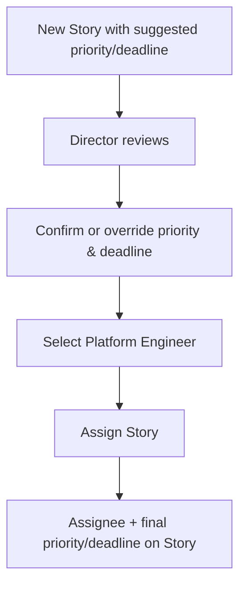

# Story 7 — Triage & Assignment (Director of Platform Engineering)

> **As a** Director of Platform Engineering,
> **I want** to triage incoming requests and assign them to the right engineer, confirming or overriding the requestor's suggested priority and deadline,
> **so that** work is prioritized correctly before any engineer is involved.

---

## Section 1 — Quick Acceptance Criteria (Human-Readable)

- New Stories arrive with the requestor's suggested priority and deadline recorded.
- The Director can confirm or override the priority and deadline.
- The Director can assign the Story to a Platform Engineer.
- Assignment happens before any engineer is engaged.
- The final priority, deadline, and assignee are reflected on the Story.

---

## Section 2 — Detailed Acceptance Criteria (Gherkin)

```gherkin
Feature: Director triage and assignment

  Scenario: Suggested priority and deadline are available for triage
    Given a new Story created from an intake request
    When the Director opens it for triage
    Then the requestor-suggested priority and deadline are visible

  Scenario: Director confirms or overrides priority and deadline
    Given the Director is triaging a Story
    When they set the priority and deadline
    Then the Story reflects the Director's confirmed or overridden values

  Scenario: Director assigns to an engineer
    Given a triaged Story
    When the Director assigns it to a Platform Engineer
    Then the Story shows that engineer as the assignee
    And the engineer is engaged only at this point
```

**Definition of Done (this story):** Every intake Story can be triaged by the Director — priority/deadline confirmed or overridden and an assignee set — with the final values reflected on the Story before any engineer is engaged.

---

## Section 3 — Process / Sequence Flow



---

## Section 4 — Assumptions & Dependencies

- **Assumptions:** Only the Director/team lead triages and assigns; suggested priority/deadline were captured at intake.
- **Dependencies:** Captured suggestions from the interview (see [Story 3](story3-ac.md)), engineer hand-off behavior (see [Story 4](story4-ac.md)), assignment notification (see [Story 6](story6-ac.md)).

---

## Section 5 — Definition of Done (Measurable)

- [ ] 100% of intake Stories display the requestor-suggested priority and deadline at triage.
- [ ] Director can confirm or override priority and deadline on 100% of Stories.
- [ ] Final priority, deadline, and assignee are persisted on 100% of triaged Stories.
- [ ] 0 engineers engaged before assignment.
- [ ] Acceptance criteria reviewed and approved by the Director of Platform Engineering.
