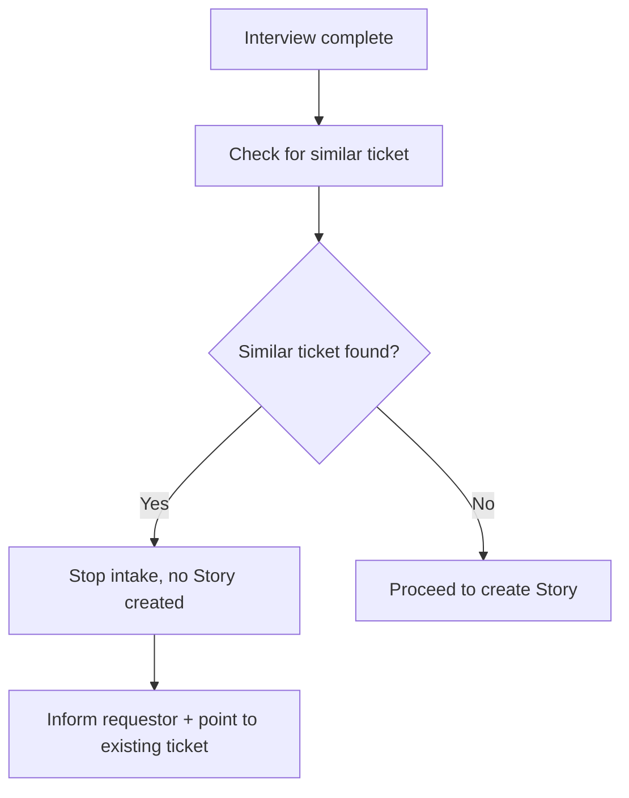

# Story 8 — Duplicate Prevention (Requestor)

> **As a** requestor,
> **I want** intake to stop and tell me when a similar ticket already exists,
> **so that** I don't create a redundant ticket and can find the existing one instead.

---

## Section 1 — Quick Acceptance Criteria (Human-Readable)

- Intake checks for a similar existing ticket before creating a Story.
- When a similar ticket is found, intake stops and no new Story is created.
- The requestor is told a similar ticket already exists.
- The requestor is pointed to the existing ticket so they can find it.
- When no similar ticket exists, intake proceeds normally.

---

## Section 2 — Detailed Acceptance Criteria (Gherkin)

```gherkin
Feature: Block redundant tickets during intake

  Scenario: Similar ticket found blocks creation
    Given a requestor has completed the intake interview
    When a similar existing ticket is identified
    Then no new Story is created
    And the requestor is told a similar ticket already exists
    And the requestor is directed to the existing ticket

  Scenario: No similar ticket allows creation
    Given a requestor has completed the intake interview
    When no similar existing ticket is identified
    Then intake proceeds and a Story is created

  Scenario: Requestor can act on the notice
    Given the requestor has been told a similar ticket exists
    When they follow the reference provided
    Then they can locate the existing ticket
```

**Definition of Done (this story):** When a similar ticket exists, intake stops with zero new Stories created and the requestor is informed and directed to the existing ticket; otherwise intake proceeds.

---

## Section 3 — Process / Sequence Flow



---

## Section 4 — Assumptions & Dependencies

- **Assumptions:** The duplicate check runs before Story creation; how similarity is determined is a design detail, not fixed here.
- **Dependencies:** Completed interview data (see [Story 3](story3-ac.md)), Story creation path (see [Story 1](story1-ac.md)), requestor messaging channel (see [Story 5](story5-ac.md)).

---

## Section 5 — Definition of Done (Measurable)

- [ ] 100% of intakes run a duplicate check before any Story is created.
- [ ] 0 new Stories are created when a similar ticket is identified.
- [ ] 100% of blocked intakes inform the requestor and reference the existing ticket.
- [ ] 100% of non-duplicate intakes proceed to Story creation.
- [ ] Acceptance criteria reviewed and approved by the Director of Platform Engineering.
